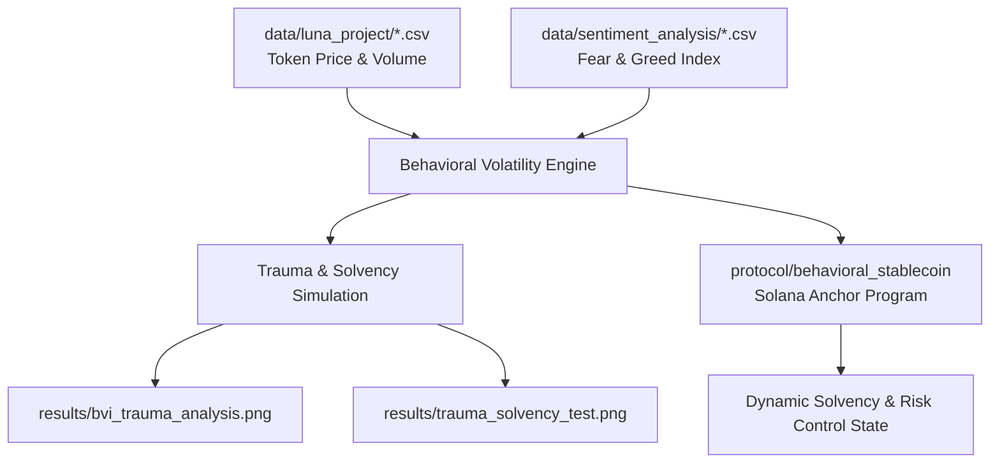
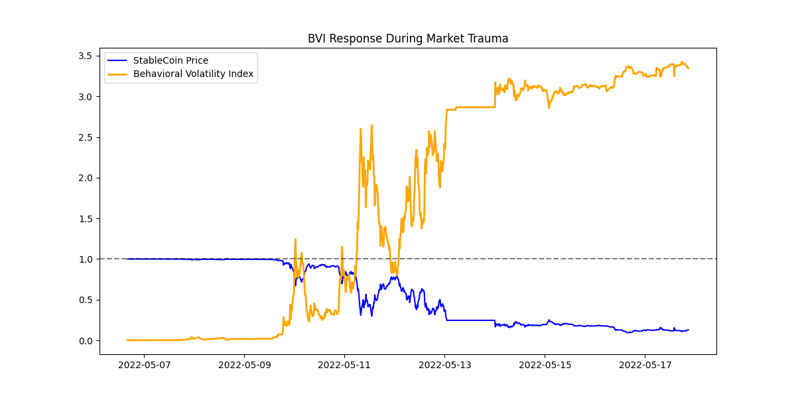
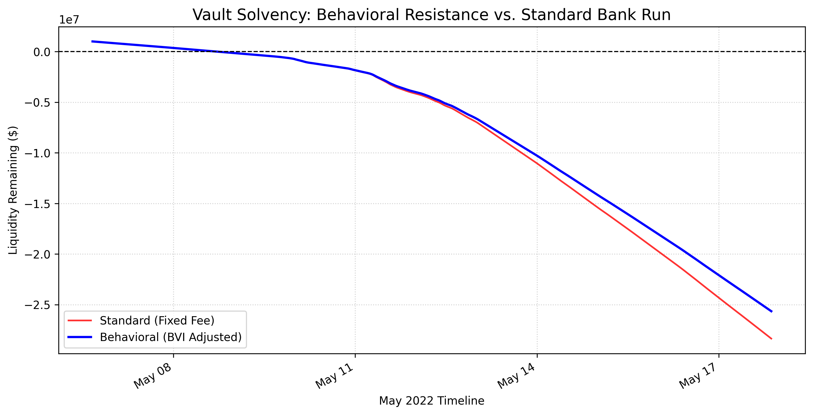

# Risk-Adaptive Stablecoin: Behavioral Volatility Index (BVI) Framework

---

### Intellectual Property & Replication 

**Notice:**

This repository contains the backtest datasets, outcome visualizations, and front-end interface for the Behavioral Volatility Index (BVI) Driven Stablecoin Framework. The core BVI mathematical model, simulation engine, and Solana Anchor smart contract programs are maintained in a private repository pending intellectual property filings.

---

An analytical research suite and on-chain protocol framework designed to evaluate behavioral market stress and maintain stablecoin solvency during systemic run events. By integrating market sentiment data (e.g., Crypto Fear & Greed Index) alongside granular token price and volume telemetry, this project models dynamic risk parameters and backtests automated circuit breakers against historical liquidity shocks, such as the May 2022 Terra-Luna collapse.

---

## Repository Directory Structure

```text
.
├── data/
│   ├── luna_project/                     # Ecosystem historical market data
│   │   ├── anchor-protocol.csv
│   │   ├── avalanche.csv
│   │   ├── binance-usd.csv
│   │   ├── bitcoin.csv
│   │   ├── bnb.csv
│   │   ├── cardano.csv
│   │   ├── dai.csv
│   │   ├── dogecoin.csv
│   │   ├── ethereum.csv
│   │   ├── polygon.csv
│   │   ├── solana.csv
│   │   ├── terra-luna.csv
│   │   ├── terrausd.csv
│   │   ├── tether.csv
│   │   ├── usd-coin.csv
│   │   └── xrp.csv
│   └── sentiment_analysis/               # Market mood & stress metrics
│       ├── fear_greed_index.csv
│       └── processed_trauma_data.csv
├── protocol/
│   └── behavioral_stablecoin/            # Solana Anchor smart contract
│       ├── app/
│       ├── Cargo.toml
│       ├── package.json
│       └── rust-toolchain.toml
├── results/                              # Analytical outputs & backtest plots
│   ├── bvi_trauma_analysis.png
│   └── trauma_solvency_test.png
├── .gitignore
├── README.md
```

---

## Architecture & Data Pipeline



---

## Core Components & Features

1. **Behavioral Volatility Index (BVI):**

   - Combines high-frequency market liquidity metrics with macro sentiment indicators to detect early signals of irrational market behavior and bank runs.

2. **Historical Stress Backtesting:**

   - Utilizes complete market telemetry surrounding major stablecoin de-pegging events (e.g., Terra/UST, DAI, BUSD, USDT) to evaluate protocol reserve health under extreme stress.

3. **On-Chain Anchor Smart Contract (protocol/behavioral_stablecoin):**

   - Solana smart contract program engineered to adjust collateralization requirements, fee tiers, or transaction limits dynamically based on incoming BVI telemetry.
  
---

## Setup & Usage

1. **Smart Contract Build (Solana / Anchor)**

  - `cd protocol/behavioral_stablecoin`
  - `anchor build`

---

## Visual Outputs

- **results/bvi_trauma_analysis.png**

  Multi-asset behavioral volatility metrics plotted across systemic panic windows.

  

- **results/trauma_solvency_test.png**
  
  Comparative evaluation showing reserve preservation and avoided liquidations under dynamic BVI parameters versus static bonding curves.

  
