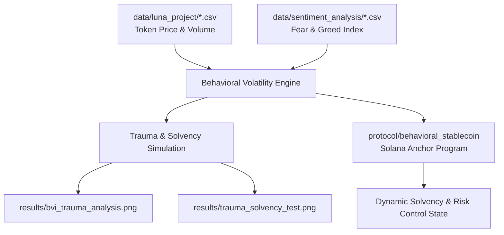

# Risk-Adaptive Stablecoin: Behavioral Volatility Index (BVI) Framework

### Intellectual Property & Replication 

**Notice:**

This repository contains the backtest datasets, outcome visualizations, and front-end interface for the Behavioral Volatility Index (BVI) Driven Stablecoin Framework. The core BVI mathematical model, simulation engine, and Solana Anchor smart contract programs are maintained in a private repository pending intellectual property filings.

---

**ABOUT**

An analytical research suite and on-chain protocol framework designed to evaluate behavioral market stress and maintain stablecoin solvency during systemic run events. By integrating market sentiment data (e.g., Crypto Fear & Greed Index) alongside granular token price and volume telemetry, this project models dynamic risk parameters and backtests automated circuit breakers against historical liquidity shocks, such as the May 2022 Terra-Luna collapse.

---

## Repository Directory Structure

```text
.
├── data/
│   ├── luna_project/
│   │   └── terrausd.csv                       # Primary UST de-pegging price & volume telemetry
│   └── sentiment_analysis/                    # Fear & Greed index & trauma sentiment metrics
├── protocol/
│   └── behavioral_stablecoin/                 # Solana Anchor smart contract protocol
├── results/
│   ├── csv/
│   │   └── processed_trauma_data.csv          # Formatted backtest telemetry output
│   └── graphs/
│       ├── bvi_trauma_analysis.png            # BVI volatility & trauma decay visual curve
│       └── trauma_solvency_test.png           # Protocol reserve solvency stress test plot
├── .gitignore                                 # Git ignore rules
└── README.md                                  # Repository documentation
```

---

## Architecture & Data Pipeline


```mermaid
graph TD
    %% Inputs
    A[data/luna_project/*.csv<br/>Token Price & Volume] --> C[Behavioral Volatility Engine]
    B[data/sentiment_analysis/*.csv<br/>Fear & Greed Index] --> C

    %% Analysis & Execution
    C --> D[Trauma & Solvency Simulation]
    D --> E[results/bvi_trauma_analysis.png]
    D --> F[results/trauma_solvency_test.png]

    %% On-Chain Program
    C --> G[protocol/behavioral_stablecoin<br/>Solana Anchor Program]
    G --> H[Dynamic Solvency & Risk Control State]
```

---

## Datasets & Data Pipeline

### 1. Terra Luna / UST Crash Crypto Price Telemetry

* **Dataset:** [Crypto Price Data During Terra Luna UST Crash](https://www.kaggle.com/datasets/avanawallet/crypto-price-data-during-terra-luna-crash)
* **Source:** Kaggle / Avana Wallet (2022)
* **Direct Access:** [](https://www.kaggle.com/datasets/avanawallet/crypto-price-data-during-terra-luna-crash)
* **Resolution:** 15-minute price and volume intervals spanning the collapse window (May 6, 2022 – May 17, 2022)
* **License:** Public Domain (CC0)

#### Data Breakdown & Categories
| Asset Category | Monitored Files | Analytical Purpose |
| :--- | :--- | :--- |
| **Terra Ecosystem Core** | `terrausd.csv`, `terra-luna.csv`, `anchor-protocol.csv` | Captures primary de-pegging velocity, hyper-inflationary minting cascades, and liquidity reserve drain. |
| **Major L1 Cryptocurrencies** | `bitcoin.csv`, `ethereum.csv`, `solana.csv`, `avalanche.csv`, `bnb.csv`, `cardano.csv`, `polygon.csv`, `dogecoin.csv`, `xrp.csv` | Evaluates cross-chain market contagion, systemic liquidity drawdowns, and collateral price shocks. |
| **Pegged Stablecoins** | `tether.csv`, `usd-coin.csv`, `dai.csv`, `binance-usd.csv` | Tracks flight-to-quality capital flows, secondary market peg stress, and arbitrage pricing discrepancies. |

### 2. Bitcoin Market Sentiment & Psychological Trauma Data

* **Dataset:** [Bitcoin Market Sentiment Dataset](https://www.kaggle.com/datasets/shambhvsatishnangre/bitcoin-market-sentiment-dataset)
* **Source:** Kaggle / Shambhu Satish Nangre
* **Direct Access:** [](https://www.kaggle.com/datasets/shambhvsatishnangre/bitcoin-market-sentiment-dataset)
* **Granularity:** Daily market psychology scores derived from the Fear & Greed Index
* **License:** CC BY-SA 4.0

#### Data Schema Breakdown
| Column | Type / Range | Description |
| :--- | :--- | :--- |
| `timestamp` | Unix Timestamp | Epoch timestamp representing the sentiment evaluation window. |
| `date` | `YYYY-MM-DD` | Human-readable calendar date of the record. |
| `value` | Integer (`0` to `100`) | Continuous mood score (lower values indicate extreme panic; higher values indicate greed). |
| `classification` | String | Categorical sentiment state (`Extreme Fear`, `Fear`, `Neutral`, `Greed`, `Extreme Greed`). |

---

## Core Components & Features

1. **Behavioral Volatility Index (BVI):**

   - Combines high-frequency market liquidity metrics with macro sentiment indicators to detect early signals of irrational market behavior and bank runs.

2. **Historical Stress Backtesting:**

   - Utilizes complete market telemetry surrounding major stablecoin de-pegging events (e.g., Terra/UST, DAI, BUSD, USDT) to evaluate protocol reserve health under extreme stress.

3. **On-Chain Anchor Smart Contract (protocol/behavioral_stablecoin):**

   - Solana smart contract program engineered to adjust collateralization requirements, fee tiers, or transaction limits dynamically based on incoming BVI telemetry.
  
---

## Setup & Usage

1. **Smart Contract Build (Solana / Anchor)**

  - `cd protocol/behavioral_stablecoin`
  - `anchor build`

---

## Visual Outputs

- **results/bvi_trauma_analysis.png**

  Multi-asset behavioral volatility metrics plotted across systemic panic windows.

  

- **results/trauma_solvency_test.png**
  
  Comparative evaluation showing reserve preservation and avoided liquidations under dynamic BVI parameters versus static bonding curves.

  
