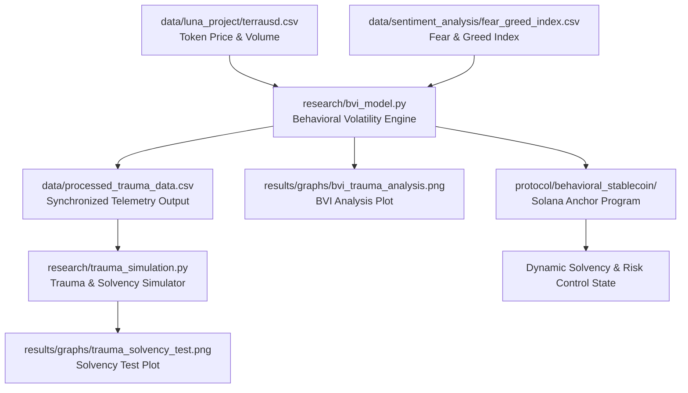
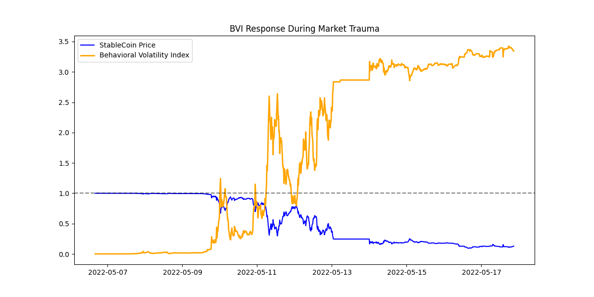
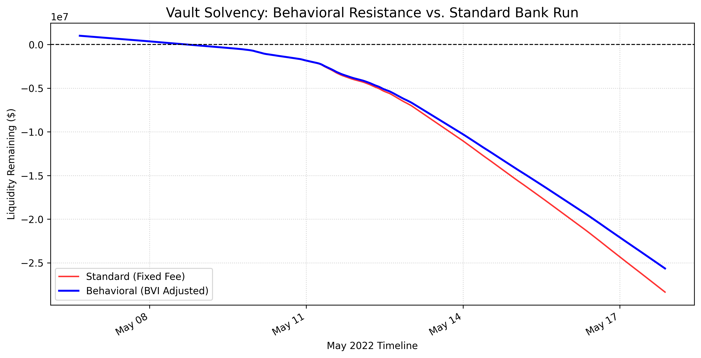

# Risk-Adaptive Stablecoin: Behavioral Volatility Index (BVI) Framework

**ABOUT**

An analytical research suite and on-chain protocol framework designed to evaluate behavioral market stress and maintain stablecoin solvency during systemic run events. By integrating market sentiment data (e.g., Crypto Fear & Greed Index) alongside granular token price and volume telemetry, this project models dynamic risk parameters and backtests automated circuit breakers against historical liquidity shocks, such as the May 2022 Terra-Luna collapse.

---

## Repository Directory Structure

```text
.
├── data/
│   ├── luna_project/
│   │   └── terrausd.csv                   # Primary UST de-pegging price & volume telemetry
│   └── sentiment_analysis/
│       └── fear_greed_index.csv           # Fear & Greed index & market psychology metrics
├── protocol/
│   └── behavioral_stablecoin/             # Solana Anchor smart contract protocol
├── research/
│   ├── bvi_model.py                       # Behavioral Volatility Index execution pipeline
│   └── trauma_simulation.py               # Vault solvency bank-run stress simulator
├── results/
│   ├── csv/
│   │   └── processed_trauma_data.csv      # Synchronized BVI backtest telemetry output
│   └── graphs/
│       ├── bvi_trauma_analysis.png        # BVI volatility & trauma response plot
│       └── trauma_solvency_test.png       # Protocol reserve solvency stress test plot
├── .gitignore                             # Git ignore rules
├── README.md                              # Repository documentation
└── requirements.txt                       # Python environment dependencies
```

---

## Architecture & Data Pipeline


```mermaid
graph TD
    %% Inputs
    A[data/luna_project/terrausd.csv<br/>Token Price & Volume] --> C[research/bvi_model.py<br/>Behavioral Volatility Engine]
    B[data/sentiment_analysis/fear_greed_index.csv<br/>Fear & Greed Index] --> C

    %% BVI Execution & Processing
    C --> D[data/processed_trauma_data.csv<br/>Synchronized Telemetry Output]
    C --> E[results/graphs/bvi_trauma_analysis.png<br/>BVI Analysis Plot]

    %% Simulation Execution
    D --> F[research/trauma_simulation.py<br/>Trauma & Solvency Simulator]
    F --> G[results/graphs/trauma_solvency_test.png<br/>Solvency Test Plot]

    %% On-Chain Program Integration
    C --> H[protocol/behavioral_stablecoin/<br/>Solana Anchor Program]
    H --> I[Dynamic Solvency & Risk Control State]
```

---

## Datasets & Data Pipeline

### 1. Terra Luna / UST Crash Crypto Price Telemetry

* **Dataset:** [Crypto Price Data During Terra Luna UST Crash](https://www.kaggle.com/datasets/avanawallet/crypto-price-data-during-terra-luna-crash)
* **Source:** Kaggle / Avana Wallet (2022)
* **Direct Access:** [](https://www.kaggle.com/datasets/avanawallet/crypto-price-data-during-terra-luna-crash)
* **Resolution:** 15-minute price and volume intervals spanning the collapse window (May 6, 2022 – May 17, 2022)
* **License:** Public Domain (CC0)

#### Data Breakdown & Categories
| Asset Category | Monitored Files | Analytical Purpose |
| :--- | :--- | :--- |
| **Terra Ecosystem Core** | `terrausd.csv`, `terra-luna.csv`, `anchor-protocol.csv` | Captures primary de-pegging velocity, hyper-inflationary minting cascades, and liquidity reserve drain. |
| **Major L1 Cryptocurrencies** | `bitcoin.csv`, `ethereum.csv`, `solana.csv`, `avalanche.csv`, `bnb.csv`, `cardano.csv`, `polygon.csv`, `dogecoin.csv`, `xrp.csv` | Evaluates cross-chain market contagion, systemic liquidity drawdowns, and collateral price shocks. |
| **Pegged Stablecoins** | `tether.csv`, `usd-coin.csv`, `dai.csv`, `binance-usd.csv` | Tracks flight-to-quality capital flows, secondary market peg stress, and arbitrage pricing discrepancies. |

### 2. Bitcoin Market Sentiment & Psychological Trauma Data

* **Dataset:** [Bitcoin Market Sentiment Dataset](https://www.kaggle.com/datasets/shambhvsatishnangre/bitcoin-market-sentiment-dataset)
* **Source:** Kaggle / Shambhu Satish Nangre
* **Direct Access:** [](https://www.kaggle.com/datasets/shambhvsatishnangre/bitcoin-market-sentiment-dataset)
* **Granularity:** Daily market psychology scores derived from the Fear & Greed Index
* **License:** CC BY-SA 4.0

#### Data Schema Breakdown
| Column | Type / Range | Description |
| :--- | :--- | :--- |
| `timestamp` | Unix Timestamp | Epoch timestamp representing the sentiment evaluation window. |
| `date` | `YYYY-MM-DD` | Human-readable calendar date of the record. |
| `value` | Integer (`0` to `100`) | Continuous mood score (lower values indicate extreme panic; higher values indicate greed). |
| `classification` | String | Categorical sentiment state (`Extreme Fear`, `Fear`, `Neutral`, `Greed`, `Extreme Greed`). |

---

## Core Components & Features

1. **Behavioral Volatility Engine (`research/bvi_model.py`):**
   - Synchronizes high-frequency 15-minute Terra/UST price telemetry (`terrausd.csv`) with market psychology metrics (`fear_greed_index.csv`) via backward `asof` merging to compute real-time peg deviation and fear-factor metrics.

2. **Trauma & Solvency Simulator (`research/trauma_simulation.py`):**
   - Backtests bank-run liquidity drawdowns during systemic collapse events, evaluating vault solvency retention by comparing fixed-fee baselines against dynamic, BVI-adjusted fee escalation curves.

3. **On-Chain Anchor Protocol (`protocol/behavioral_stablecoin/`):**
   - Solana smart contract program engineered to process BVI risk telemetry and dynamically adjust collateralization requirements, transaction fees, and withdrawal limits on-chain.
  
---

markdown
## ⚙️ Setup & Usage

### 1. System & Environment Dependencies

* **Python:** `Python 3.10+`
* **Rust Toolchain:** `1.70.0+` (`rustup`, `rustc`, `cargo`)
* **Solana CLI:** `1.16+` or `1.18+`
* **Anchor CLI:** `0.28.0+` / `0.29.0+`
* **Node.js & Package Manager:** `Node v18+`, `yarn 1.22+`

### 2. Python Analytics Setup

Install repository dependencies and execute the analytics pipeline:

```bash
# Install Python dependencies
pip install -r requirements.txt

# Run BVI data sync, feature engineering, and plot generation
python research/bvi_model.py

# Run bank-run solvency stress simulation
python research/trauma_simulation.py
```

---

## Visual Outputs

- **bvi_trauma_analysis.png**

  

  As shown in above figure, the model successfully quantifies the transition from stability to “market trauma” during the Terra-Luna de-pegging event. It can be seen that there is an inverse correlation between the Stablecoin Price and the BVI. Furthermore, as price volatility increases, the BVI scales proportionally capture the intensity of behavioral “fear” and capital flight. It can be visualized that when the stablecoin price and behavioral volatility index intersected with each other after 5th of May 2022, potentially shifting the sentiment from “Caution” to “Trauma” indicating that behavioral panic has overridden price stability. Further, as the gap widens between the two lines shows the de-pegging velocity. The intersection is the “point of no return” where standard fixed-fee protocols typically fail, but your BVI-adjusted model begins to exert resistance to preserve vault solvency.

- **trauma_solvency_test.png**

  

  The above graph shows that the mechanical advantage of a risk-adaptive framework over traditional fixed-fee models. In a simulated bank run environment based on May 2022 timeline data, the Standard (Fixed Fee) model represents a faster depletion of liquidity. On the contrary, the Behavioral (BVI Adjusted) model utilizes the BVI as a real-time signal to adjust protocol fees, slowing the rate of liquidity exit and preserving vault solvency for a longer duration.
